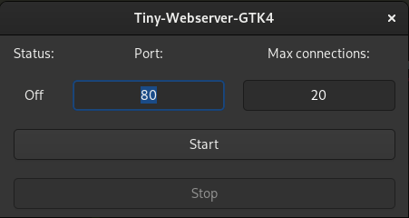

</img>

<h1>Tiny-Webserver-GTK4</h1>

A tiny webserver with GTK4 GUI written in C

 <i>
mkdir builddir &&
meson setup builddir &&
meson compile &&
sudo ./webserver-gtk
 </i> 

Put startpage "index.html" in the same folder of webserver-gtk executable.

