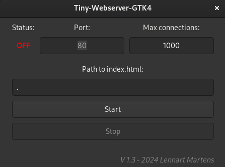
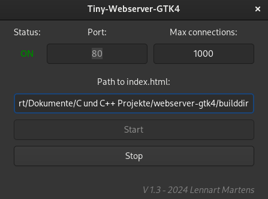

<h1>Tiny-Webserver-GTK4 for LINUX</h1>

A tiny webserver with GTK4 GUI written in C

</img>

Default path to index.html is current working dir
</img>

Compile and run:

<i>
mkdir builddir &&
meson setup builddir &&
meson compile &&
sudo ./webserver-gtk
</i>

