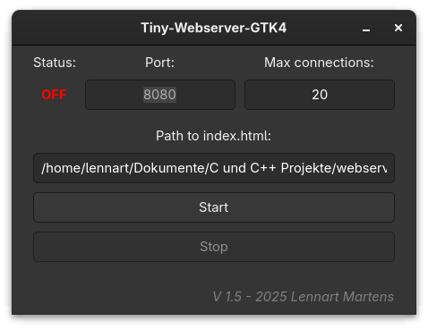
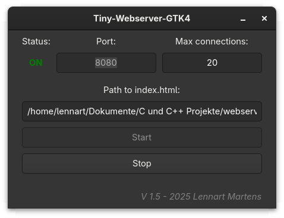

<p><h1>Tiny-Webserver-GTK4 for LINUX</h1>
</p><p>A tiny webserver with GTK4 GUI written in C</p>
<p></p></img></p>
<p>Default path to index.html is current working dir</p></img></p>

## Build and start:
```bash
mkdir builddir && meson setup builddir && meson compile -C builddir && cd builddir && ./webserver-gtk
```
## Testrun:
For a testrun you can copy the file "index.html" to your server path.

In your browser open: http://localhost:8080/

Enjoy!
##
Version: 1.5 


